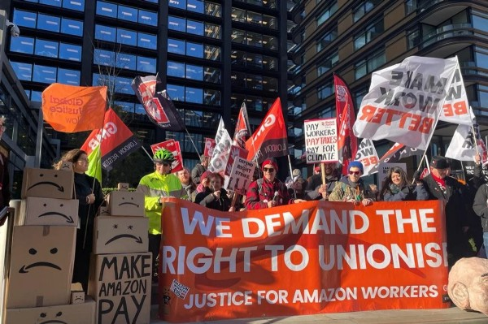

⤵️ [Jump to Navigation](#navigations)

# The evil of Amazon as a company

Amazon is one of the largest company in the US with a wide range of consumer and enterprise products and service offerings. While they have one of the world's biggest cloud business, they are mostly known to the general consumer for Amazon Ecommerce[^1] which sells multitudes of products offered by many merchants. 

## Scores

| Division        | Score  |
| ----------------- | -------- |
| Privacy         | 2.8/10 |
| Right-to-repair | 4.8/10 |
| Envrionmental   | 4.1/10 |
| Fair trade      | 2.0/10 |

# Deeds

## Monopoly

Unlike the other evils in our list, Amazon maintains monopoly differently. The recent lawsuit by the FTC[^1] reveals how Amazon maintains a strong grip in the market and dominates it. In the lawsuit, FTC notes:

> "Amazon violates the law not because it is big, but because it engages in a course of exclusionary conduct that prevents current competitors from growing and new competitors from emerging. By stifling competition on price, product selection, quality, and by preventing its current or future rivals from attracting a critical mass of shoppers and sellers, Amazon ensures that no current or future rival can threaten its dominance. Amazon’s far-reaching schemes impact hundreds of billions of dollars in retail sales every year, touch hundreds of thousands of products sold by businesses big and small and effect over a hundred million shoppers."

What FTC means by this is not clear, because just providing better services does not mean you are a monopoly. So there are more to this lawsuit and in reality. Amazon runs a cloud service that makes it hard to get out. To close a contract, you must jump insane hoop[^2] and even then, there is no way to close an AWS account. 

Another way Amazon used to hold monopoly is by having exclusive partner, and booting existing third party merchants who already sold those products[^3]. Not even a year had gone by, Amazon was sued again for meddling with the pricing artificially and teaming up with Apple[^4]. This caused immense loss for many third party resellers and recyclers.

## Labour rights abuse

[TO BE CONTINUED: [Help extend the pages](https://github.com/imahbub/evilapple/discussions)]

[^1]: https://www.ftc.gov/news-events/news/press-releases/2023/09/ftc-sues-amazon-illegally-maintaining-monopoly-power

[^2]: https://medium.com/codex/you-cant-close-an-aws-account-because-it-s-coded-that-way-5b03d16cf9ed

[^3]: https://www.theverge.com/2018/11/9/18079340/amazon-apple-iphone-ipad-watch-beats-deal-selling-products-online

[^4]: https://www.reuters.com/legal/apple-amazon-must-face-consumer-lawsuit-over-iphone-ipad-prices-us-judge-2023-06-09/

# Navigations:

🏠 [Home](https://evilapple.org), 📝 [Blog](/pages/blog) 📖 [About this website](about), 📢 [What are deeds?](deeds)

Social: 

Other projects: 

---

*Copyleft 2023, The Penguins Club*

