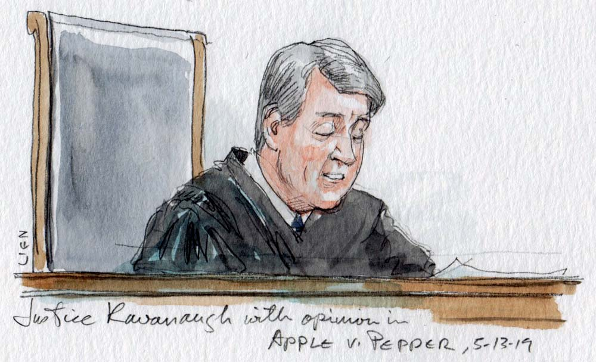

⤵️ [Jump to Navigation](#navigations)

# The evils of Apple as a company

Apple is the largest company by market capital[^1]. While they do have competition, Apple has been accused of unfair trades and monopolistic behaviour.

## Scores

| Division        | Score  |
| ----------------- | -------- |
| Privacy         | 4.7/10 |
| Right-to-repair | 4.0/10 |
| Envrionmental   | 4.8/10 |
| Fair trade      | 2.0/10 |

## Deeds

### Monopoly

Apple has been accused of monopolistic behaviour in many occasions, since the rise of the company till now. This is due to the reason that Apple does not play well with its competitors and uses legal loopholes to establish dominance. One of the prime example is controlling the ecosystem and creating vendor lock-ins, so people cannot leave the company wall[^2].

In the past, Apple has been responsible for direct elimination of its competitors that benefits them to the day. One example is the acquisition of Beats Music[^3]. This acquisition directly eliminated various completion in audio and music consumer market and helped make Apple Music and Apple wireless earbuds, wireless headphones a reality. 

[TO BE CONTINUED: [Help extend the pages](https://github.com/imahbub/evilapple/discussions)]

[^1]: https://companiesmarketcap.com/apple/marketcap/
    
[^2]: https://www.techconstant.com/apples-lock-in/

[^3]: https://www.apple.com/newsroom/2014/05/28Apple-to-Acquire-Beats-Music-Beats-Electronics/

# Navigations:

🏠 [Home](https://evilapple.org), 📝 [Blog](/pages/blog) 📖 [About this website](about), 📢 [What are deeds?](deeds)

Social: 

Other projects: 

---

*Copyleft 2023, The Penguins Club*

