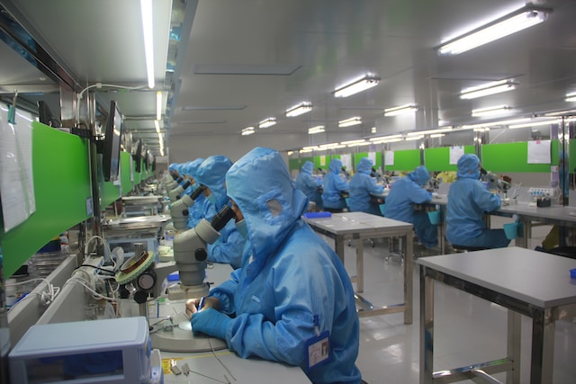

⤵️ [Jump to Navigation](#navigations)

Credit: Photo by <a href="https://unsplash.com/@glsun?utm_content=creditCopyText&utm_medium=referral&utm_source=unsplash">Glsun Mall</a> on <a href="https://unsplash.com/photos/man-in-blue-jacket-wearing-blue-mask-WNX6uk-1LV4?utm_content=creditCopyText&utm_medium=referral&utm_source=unsplash">Unsplash</a>

# What are deeds?

Deeds are types of malicious behaviour done by companies. Here is a list and details:

### Vendor lock-in

When a vendor locks-in users with long contracts or a tecnology they cannot migrate or move from. For example, a company forces you to sign 2 years of contract and charges for those years when you want to cancel early.

Another most prevelant example is when a company locks you in with a technology or a protocol that cannot be accessed from another platform, or gives you no option for migrating or leaving the platform.

In todays world, a prime example would be iMessage, which does not let Android user join in. And it does not let users migrate to another platform without losing data.

### Anti right-to-repair

When a company actively tries to stop users from reparing a product by themselves or from a third party. This is done by making the repair tools and parts unavailable for third party repairers, making repair unfriendly parts, locked or serialised parts, unonventional non-standard toolkit requirments, etc.

This is usually done for extracting profit from first party repairs, as some of the companies earn significant revenue from this source. While it earns value for the companies, it makes the users life hard and is considered a form of extortion. Making devices repairable also makes lifepspan of said devices longer, making some companies worried they will lose money.

### Monopoly

Monopoly, or anti competitive behaviour is a trade malpractice that hinders competition and makes peoples life harder by giving them less choice. When a company grows big, it may gain too much financial resources and authority. They may reduce competition by buying out the competitors, filing large volume of patents, partnering up with other big companies to mutually reduce compeition.

### Privacy invasive

This is when a company invades your personal space by employing data collection and logging. Companies may use legal loopholes to connect personally identifiable data without permission, or may hide terms in fine prints. Most of the free to use application economy runs this way, and the company uses data to pay for the operation cost. This data is then used for targeted advertising, political intention, surveillance, criminal investigation and data extraction, etc.

### Anti consumer

This is when a company does something that directly or indirectly harms the consumer. When a company takes away certain promised functionality or access to a product, or when a company tries to extort or upsell more by hindering their ability to do something with a product by artificial means. This happens when a company focuses on interest of the business rather than the consumer.

### Greenwashing

Greenwashing is when a company tries to appear environmentaly friendly but are actually doing very less, or using legal loopholes to declare initiatives which have very low effectiveness. They may also use deceptive marketing to overstate their effort.

### Anti environmental

When a company actively takes part in damaging the environment by increasing production, promotion of excess sales and generation of waste, actively avoiding responsibilities, excessive use of rare earth metals, use of production methods that generates significant pollution.

### Labour rights abuse

This is when a company treats their workers harshly and or promote inequality. This may lead to wage gaps, unsafe working conditions, physical injuries, bad psychological effects, increase poverty, create class gaps. It also has high chance of rising debt among those workers.

### Promotion of modern slavery

It is same as labour rights abuse, but with the added chance of having severe global consequences. Some company simply get away with dealing with labour rights, by using third party employers or contractors, that in turn, exploits low wage labour for cheaper production, on a global scale. Countries like China, and several African countries where millions live in poverty are forced to work in poor condition because very few company cares about better treatment of foreign contract workers compared to local workers.

### Political manipulation

This is when a company takes part in national or foreign politics and helps propegate information on behalf of certain parties. This may lead to suppression of information and spread of purposeful misinformation for political gain of said parties.

### NSA involvement

This is simply when a company takes part in nationwide security operations and programs held by NSA.

### Participation in CCP campaign

This is simply when a company takes part in surveillance or supression of data and critical public knowledge against the CCP.

---

If you have any confusion, or want to discuss about the categories, please open a discussion at the repo discussion page.

# Navigations:

🏠 [Home](https://evilapple.org), 📝 [Blog](/pages/blog), 📖 [About this website](about), 📢 What are deeds? - Current page

Social: 

Other projects: 

---

*Copyleft 2023, The Penguins Club*

