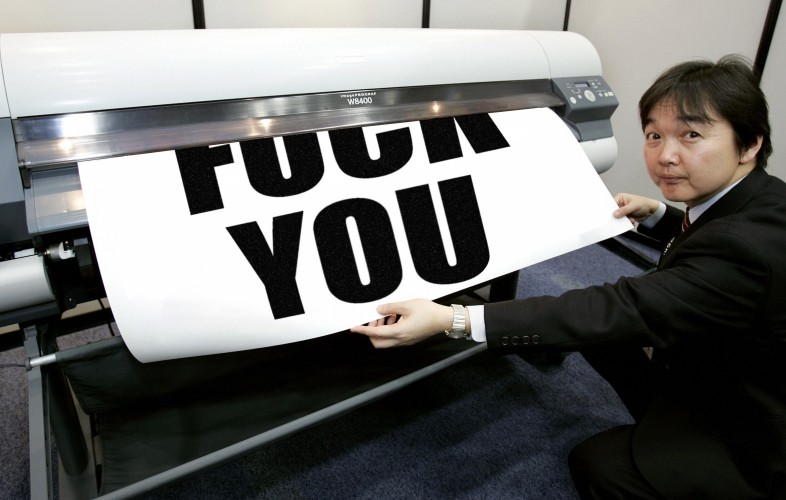

⤵️ [Jump to Navigation](#navigations)

# The mind boggling evil business of printer companies

> Warning: This entry is a bit biased and written in personal tone.

After the end of lightbulb business, very few businesses in the world remains to this date that employs the same tactic. But none of those business are as widespread and large in scale compared to printers. Printers, despite having many competitors, are still a big disappointment and many people prefer to call the whole ordeal a big scam. 

## Scores

| Division        | Score  |
| ----------------- | -------- |
| Privacy         | 3.0/10 |
| Right-to-repair | 0.0/10 |
| Envrionmental   | 1.5/10 |
| Fair trade      | 0.2/10 |

## The origin

Printer business started as B2B trade that offered laser printing and copying via rental business model. Due to the high R&D cost at that time, and low maturity, printer companies used to supply all the accessories themselves, and charge a subscriptions [^1].

After printing became more available for personal computing oriented in the 1980s [^2], people slowly started to adopt it. First companies came up with cheaper laser printers, then around 2008 came ink jet printing. 

## The evil begins

Right after the inception of ink jet, companies noticed that they can make more money selling inks than the printer itself. The start of personal printing was not supposed to be like this. But it did. Companies like HP grew in size and sold large quantities of ink jet printers around the world. But they also kick-started a new trend with it. 

Ink jet printers contain small quantities of ink by default. The technology does not permit holding large quantities of ink by design [^3]. Many third parties tried to go over the designs' limitations, but could not go so far. On top, the inks dry quicker, almost in weeks. If that's not enough, companies employed tactics to prevent third party ink manufacturers from selling cheaper options. 

## Preventing third party cartridges

Many printer companies now use chips in the cartridge itself to verify integrity, and in turn disable printing if they detect third party cartridges via firmware update [^4]. They are pretty direct about it, too. No shame, no hiding. If only they were this honest about the right things. 

There is virtually nothing wrong with third party inks, and the alleged issues' printer companies present are very stupid [^5]. If you google your concern over third party inks, 90% of the result that speaks against third party inks are partners of printer companies. 

## Ink costs nothing to make

Companies spends mere cents to make inks that are sold for absurd markup [^6]. The ink sellers and distributors of first party inks loves to talk about the cost of research and development cost, and how printers are actually cheaper, but the main reason they agree with it is that again, they are partners with printer companies. Most of the current printing tech has already been perfected by the end of 2010, and currently companies spend more time on how to effectively piss off users with annoying chips and warnings than actual R&D on making friendlier products.

## Privacy concerns

Printer companies like HP, Canon, etc. offers benefit like cloud printing or smart printing. And like in the case of everything smart and connected, these offerings to come with severe privacy concern. Many of these smart features violates user's privacy by collecting scanned data, print data, files and personally identifiable meta data such as location and device unique ID [^7]. 

## Environmental concerns

Printer companies are responsible for significant amount of environmental damage and e-waste. It is more prevelant in the case of ink jet printers, which uses single use cartridges, but not limited to it. Every type of printer to the date is not environmentally friendly. Printers are made with mostly non-recyclable materials and heavy metals that pollutes the earth and also promotes unfair mining [^8].

## There is no good players

Contrary to the belif, there is no fair player in this market, and even companies like Brother has succumbed to it [^9]. Printers avoid getting caught in legal troubles thanks to other companies lobbying and passing laws that does not make planned obsolence a crime. Although there have been a trial in the europe [^10]. 

Currently no independent or small scale effort to prevent it has arise. Please create a discussion if you know any project. Currently the only way to deal with it, is to make peace with it by buying a bit more expensive ink tank printers that allows third party inks. Which are still bad, but at least you can save some money on the inks. 

[TO BE CONTINUED: [Help extend the pages](https://github.com/imahbub/evilapple/discussions)]

[^1]: https://books.google.com.bd/books?vid=ISBN1573565210
    
[^2]: https://books.google.com.bd/books?id=UOZRAwAAQBAJ&pg=PA5

[^3]: https://www.ldproducts.com/articles/ink-cartridge-guide

[^4]: https://epson.com/no-third-party-ink-cartridges

[^5]: https://www.which.co.uk/news/article/third-party-printer-ink-three-common-worries-debunked-aCV0u5q3t7a0

[^6]: https://pirg.org/edfund/resources/how-printers-keep-us-hooked-on-expensive-ink/

[^7]: https://www.washingtonpost.com/technology/2023/07/10/printing-privacy-security-printed-documents/

[^8]: https://www.capitalmds.com/the-impact-of-printing-on-the-environment/

[^9]: https://news.ycombinator.com/item?id=31860131

[^10]: https://www.forbes.com/sites/davidschrieberg1/2017/09/26/landmark-french-lawsuit-attacks-epson-hp-canon-and-brother-for-planned-obsolescence/?sh=745b799f1b36

# Navigations:

🏠 [Home](https://evilapple.org), 📝 [Blog](/pages/blog), 📖 [About this website](about), 📢 [What are deeds?](deeds)

Social: 

Other projects: 

---

*Copyleft 2023, The Penguins Club*

